<h2 align="center" style="color:#38c2bb;">📚 PS-eNewsletter</h2>

  <a href="https://github.com/Power-Source/e-newsletter/discussions" style="color:#38c2bb;">💬 Forum</a>
  <a href="https://github.com/Power-Source/e-newsletter/releases" style="color:#38c2bb;">📝 Download</a>

**Das ultimative Newsletter Plugin für WordPress. Keine Drittanbieterdienste oder Abo-Kosten, Newsletter direkt aus dem WordPress-Dashboard managen und versenden.**

## PS-eNewsletter bringt professionelle Newsletter-Erstellung und Abonnentenverwaltung in WordPress.

Denke an all das Geld, das Du sparst, wenn Du auf den E-Mail-Dienst eines Drittanbieters verzichtest. Auch werden keine Daten Deiner Benutzer an Dritte gesendet, Du hast die volle Kontrolle.

### Einfache Newsletter-Erstellung

Verwende den bekannten WordPress-Customizer, um eine E-Mail-Vorlage und einen Layoutinhalt auszuwählen. Sieh Dir genau an, wie Deine Nachricht aussehen wird, bevor Du auf „Senden“ klickst. Wähle aus den professionell erstellten Vorlagen oder erstelle Deine eigenen.

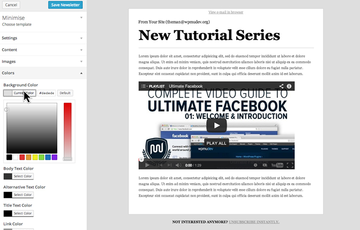

  Gestalte fantastisch aussehende Newsletter sehr schnell.

### Füge eine persönliche Note hinzu

Verwende Datenerstellungs-Tags, um Mitgliederdaten in Deine E-Mails zu integrieren und so Newsletter zu personalisieren. Peppe Dein Design mit Kopfzeilen und Hintergrundbildern auf und behalte die volle Kontrolle über die Farben.

### Abonnenten einfach hinzufügen und verwalten

Bette Abonnementformulare mithilfe eines Widgets oder eines Shortcodes ein. Sammel einfach eine E-Mail-Adresse oder konfiguriere die Erfassung eines Vornamens und lasse Abonnenten die Gruppe auswählen, der sie beitreten möchten. PS-eNewsletter unterstützt die empfohlene Double-Opt-In-Methode zum Abonnieren und ermöglicht die Einrichtung einer „Willkommens“-E-Mail, die automatisch an alle neuen Abonnenten gesendet wird, zusammen mit benutzerdefinierten Seiten zum Abonnieren und Abbestellen.

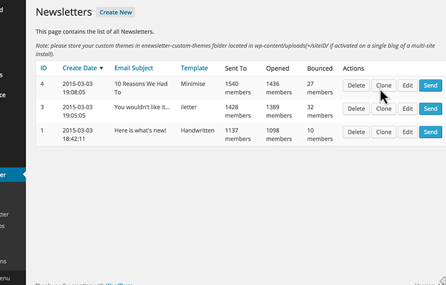

  Verwalte gesendete E-Mails und verwende sie als Vorlagen für zukünftige Newsletter.

### Newsletter versenden

Um einen Newsletter zu versenden, wähle einfach die entsprechenden Empfänger aus, klicke auf „Senden“ und verfolge den Fortschritt anhand der Fortschrittsleiste. Verfolge Newsletter-Ergebnisse, verbessere Inhalte und verwende die Schaltfläche „Klonen“, um das Newsletter-Layout für zukünftige E-Mails zu beschleunigen. 

### **Installieren:**

Melde Dich bei Deinem Admin-Panel für WordPress oder Multisite an und aktiviere das Plugin. Nach der Installation und Aktivierung siehst Du einen neuen Menüpunkt in Deinem Admin-Bereich: eNewsletter.

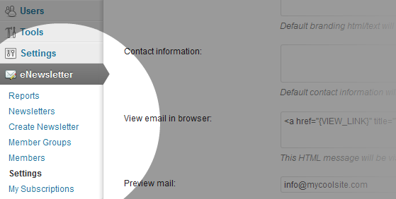

### Erste Schritte

Als Erstes solltest Du Deine Einstellungen konfigurieren. Klicke auf den Untermenüpunkt Einstellungen. Es gibt drei Registerkarten, die Deine Aufmerksamkeit sofort erfordern:

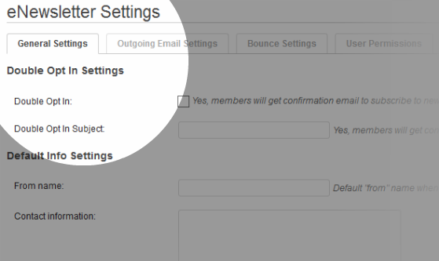

  Allgemeine Einstellungen – Deine Standardeinstellungen.

 
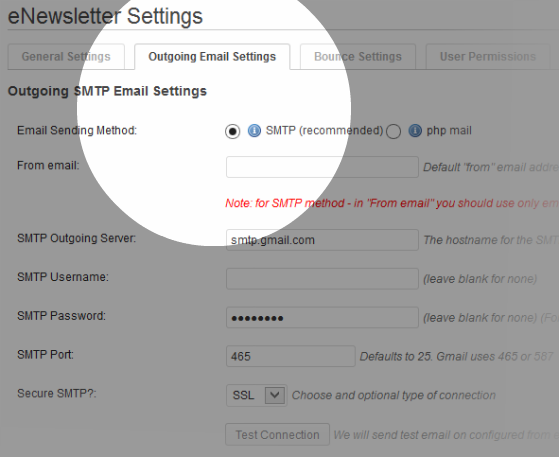

  Einstellungen für ausgehende E-Mails – wie Deine Newsletter versendet werden.

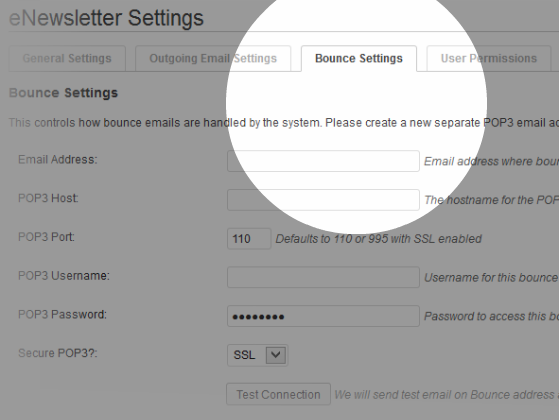

  Bounce-Einstellungen – wie mit E-Mails umgegangen wird, die zurückgesendet werden.

  Die allgemeinen Einstellungen sind ziemlich einfach. Um Dir die Einrichtung der Registerkarten „Ausgehende Einstellungen“ und „Bounce-Einstellungen“ zu erleichtern, findest Du hier einige praktische Links für die Standard-SMTP- und POP-Einstellungen, wenn Du Gmail, Yahoo oder Hotmail verwendest:

* Gmail: [https://support.google.com/mail/answer/13287?hl=en](https://support.google.com/mail/answer/13287?hl=en)
* Zusätzliche Informationen, wenn Du [Google Apps for Business](https://support.google.com/a/answer/176600?hl=en) verwendest oder deren [SMTP-Relay-Dienst](https://support.google.com/a/answer/2956491?hl=de) verwenden musst.
* _GoDaddy-Benutzer beachten:_ Wenn Sie bei GoDaddy hosten und Google Apps for Business für Ihre E-Mails verwenden, funktionieren die oben genannten Einstellungen für Gmail möglicherweise nicht richtig. Einzelheiten und empfohlene Einstellungen finden Sie in [diesem Forumsbeitrag](https://premium.wpmudev.org/forums/topic/e-newsletter-not-sending-test-email#post-898374).
* Yahoo: [http://help.yahoo.com/kb/index?page=content&y=PROD_MAIL_ML&locale=en_GB&id=SLN4724](http://help.yahoo.com/kb/index?page=content&y=PROD_MAIL_ML&locale=en_GB&id =SLN4724)
* Hotmail (live.com): [http://windows.microsoft.com/en-CA/windows/outlook/send-receive-from-app](http://windows.microsoft.com/en-CA/ Windows/Outlook/Send-Receive-from-App)

Wenn Du die Webmail-Dienste Deines Hosts nutzt, kannst Du die benötigten Einstellungen in cPanel abrufen. Gehe zu „E-Mail-Konten hinzufügen/entfernen“. Wähle neben dem E-Mail-Konto, für das Du die Einstellungen festlegen möchtest, im Dropdown-Menü „E-Mail-Client konfigurieren“ aus. Auf der nächsten Seite findest Du alle notwendigen Einstellungen.

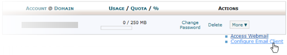

 

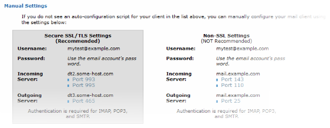

  Sobald Du Deine Ausgangs- und Bounce-Einstellungen konfiguriert hast, klicke jeweils auf die Schaltfläche „Verbindung testen“, um sicherzustellen, dass sie ordnungsgemäß funktionieren. Als nächstes: die Registerkarte „Benutzerberechtigungen“. Hier kannst Du die Funktionen jeder aktiven Benutzerrolle auf Deiner Webseite optimieren.

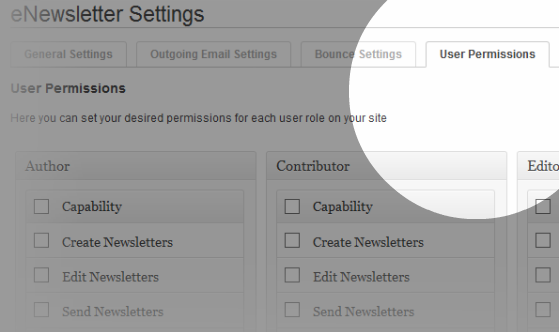

  Wenn Du nicht möchtest, dass andere Benutzer Zugriff auf Einstellungen haben, kannst Du alles leer lassen. Die Administratorrolle wird dort nicht angezeigt, da sie standardmäßig über alle Funktionen verfügt.

### Erstellen eines Newsletters

Nachdem Du nun alles in den Einstellungen konfiguriert hast, können wir einen Newsletter erstellen! Klicke in Deinem eNewsletter-Menü auf „Newsletter erstellen“. Du siehst den Newsletter-Builder, der die WordPress-Anpassungsfunktion nutzt, um Dir die Arbeit wirklich zu erleichtern. Es wird auch in Echtzeit aktualisiert!

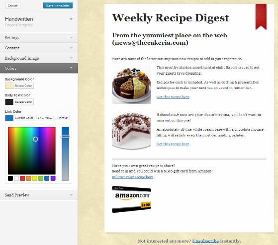

  Vollständig anpassbare Vorlagen mit dem WYSIWYG-Builder.

  Wähle einfach die Vorlage aus, die Du verwenden möchtest, und passe dann bei Bedarf die E-Mail-Einstellungen für diesen bestimmten Newsletter an. Der WYSIWYG-Inhaltseditor sollte Dir sehr vertraut sein. Du kannst Deinem Newsletter beliebige Inhalte hinzufügen, einschließlich Links, Bilder usw.

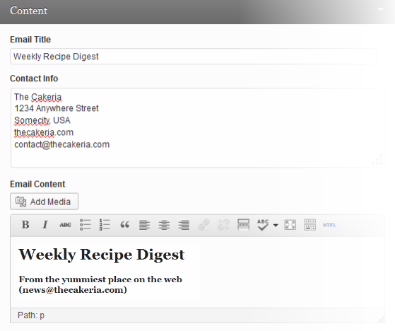

  Mit den endgültigen Einstellungen kannst Du bei Bedarf ein Hintergrundbild hinzufügen und das Farbschema anpassen. Wenn Du fertig bist, speichere Deinen Newsletter. Gib anschließend im Bereich „Vorschau senden“ Deine E-Mail-Adresse ein und klicke auf den Senden-Button. Überprüfe Deine E-Mails auf Deinen brandneuen Newsletter.

### Berichterstellung und andere Funktionen

Nachdem Du nun einen Newsletter erstellt und einige Daten gemeldet hast, schauen wir uns an, wie Du diese Daten anzeigen kannst. Klicke im eNewsletter-Menü auf „Berichte“. Dort siehst Du alle Daten zu den 5 aktuellsten Newslettern und den 5 aktuellsten Mitgliedern. Dazu gehören Informationen wie die Anzahl der versendeten Newsletter, an wie viele Mitglieder, in welchen Gruppen, wie viele geöffnet und wie viele zurückgesendet wurden. Cool was?

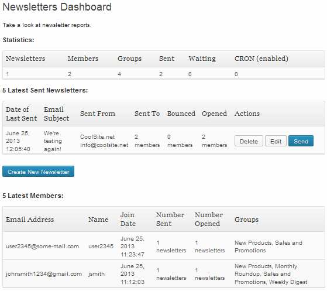

  Klicke nun im eNewsletter-Menü auf „Newsletter“. Auf diesem Bildschirm werden Informationen zu allen Newslettern angezeigt, die gesendet oder einfach erstellt wurden. Klicke einfach auf die Spaltenüberschriften, um die Anzeige nach Erstellungsdatum, Betreff oder Vorlage zu sortieren.

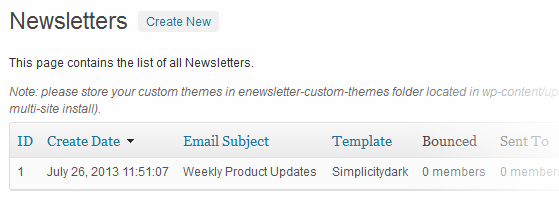

### Newsletter versenden

Wenn Du bereit bist, einen Newsletter zu versenden, klicke einfach auf die Schaltfläche „Senden“ neben dem Newsletter, den Du versenden möchtest (Du kannst dies entweder über den Bildschirm „Berichte“ oder den Bildschirm „Newsletter“ tun). Gib im nächsten Bildschirm an, an wen der Newsletter gesendet werden soll, und lege Deine Filter- und Planungseinstellungen fest.

  1\. An alle Abonnenten senden.
2\. An Abonnenten ausgewählter Gruppen senden.
3\. Senden an Abonnenten mit ausgewählten Mitgliedschaftszugriffsebenen.
4\. An Abonnenten mit bestimmten Benutzerrollen senden.
5\. An alle Netzwerkadministratoren senden.
6\. Filteroptionen festlegen.
7\. Lege Deine Planungspräferenz fest.

  Du kannst fünf spezifische Arten von Abonnenten ansprechen, die Deinen Newsletter erhalten sollen:

* Alle aktiven Mitglieder
* Ausgewählte Newsletter-Gruppen
* Abonnenten auf ausgewählten Mitgliedschafts-Zugriffsebenen
* Abonnenten mit bestimmten Benutzerrollen
* Administratoren aller Netzwerkseiten

Wenn Du „Alle aktiven Mitglieder“ auswählst, wird Dein Newsletter an alle gesendet, die sich in jeder Gruppe angemeldet haben. Mit _eNewsletter Groups_ kannst Du nur an Abonnenten ausgewählter Gruppen senden. Die Option „Membership Plugin Levels“ wird nur angezeigt, wenn auf Deiner Webseite unser [PS Mitgliedschaften Plugin](https://cp-psource.github.io/mitgliedschaften-pro/) Plugin aktiv ist. Hier kannst Du auswählen, ob Du Deinen Newsletter an Abonnenten mit bestimmten Mitgliedschaftszugangsebenen senden möchtest. Wähle beliebige _WordPress-Benutzerrollen_ aus, um den Newsletter an alle Abonnenten mit diesen ausgewählten Rollen auf Deiner Webseite zu senden. Wenn Du das Kontrollkästchen „Admins aller Sites“ aktivierst, wird Dein Newsletter an alle Subseiten-Administratoren in Deinem Netzwerk gesendet. Beachte, dass mit dieser Option Dein Newsletter an alle Subseiten-Administratoren gesendet wird, unabhängig davon, ob diese abonniert sind oder nicht. Du kannst die Benutzer filtern, die Deinen Newsletter erhalten sollen, sodass diejenigen, die ihn bereits erhalten haben, ihn nicht noch einmal erhalten. Du kannst auch festlegen, dass ein Newsletter nur an ausgewählte Benutzer erneut gesendet wird, deren vorheriger Versand zurückgesendet wurde. Abschließend hast Du 3 Möglichkeiten, Deinen Newsletter zu versenden:

* Klicke auf die große blaue Schaltfläche „Newsletter jetzt senden“, um ihn sofort an alle Personen zu senden, die Du oben ausgewählt hast.
* Klicke auf die Schaltfläche „Im Hintergrund senden“, damit WordPress sich über CRON darum kümmert, während Du Dich um andere Geschäfte kümmerst.
* Klicke auf den Link „Bearbeiten“, um das Formular zu öffnen, in dem Du Deinen Newsletter für ein bestimmtes Datum und eine bestimmte Uhrzeit planen kannst.

### Gruppen-Mailinglisten

Ach ja... haben wir schon Gruppen erwähnt? Schauen wir uns das jetzt einmal an. Gehe im eNewsletter-Menü auf „Mitgliedergruppen“. Dort kannst Du so viele Gruppen erstellen, wie Du benötigst oder möchtest. Mitgliedergruppen sind im Grunde Mailinglisten, die Deine Benutzer abonnieren können.

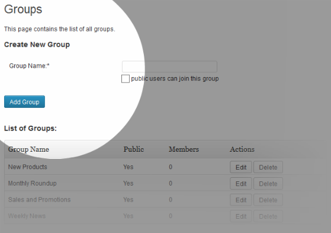

  Sobald sich Benutzer für Gruppen-Newsletter angemeldet haben, kannst Du diese Informationen auf der Seite „Mitglieder“ anzeigen und bearbeiten. Klicke Sie im eNewsletter-Menü auf „Mitglieder“, um den Newsletter jetzt anzuzeigen.

### Mitglieder verwalten

Auf dem Mitgliederbildschirm findest Du alle Informationen darüber, wie viele Newsletter an jedes Mitglied gesendet wurden, wie viele geöffnet oder zurückgesendet wurden und bei welchen Gruppen sie abonniert sind. Du kannst die Anzeige sortieren, indem Du auf eine beliebige Spaltenüberschrift klickst, und mithilfe der Schaltflächen „Anzeigen“ filterst, um nur bestimmte Kategorien anzuzeigen.

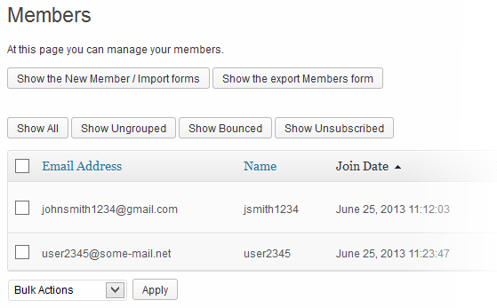

  Du kannst die Anzeige sogar so filtern, dass nur die Daten zu einem bestimmten Newsletter angezeigt werden, indem Du in der Spalte „Gruppen“ auf den Newsletternamen klickst. Klicke in der Spalte „Aktionen“ auf die Schaltfläche „Gruppen ändern“, damit jeder Benutzer ihn sofort zu beliebigen Gruppen hinzufügen oder daraus entfernen kann. Um Dir bei der Suche nach den gesuchten Benutzern zu helfen, gibt es sogar ein praktisches Suchformular, mit dem Du nach beliebigen Textzeichenfolgen suchen kannst. Um beispielsweise alle Benutzer mit einer Gmail-Adresse zu finden, gib einfach gmail in das Suchfeld ein. Klicke: Sofortige benutzerdefinierte Sortierung!

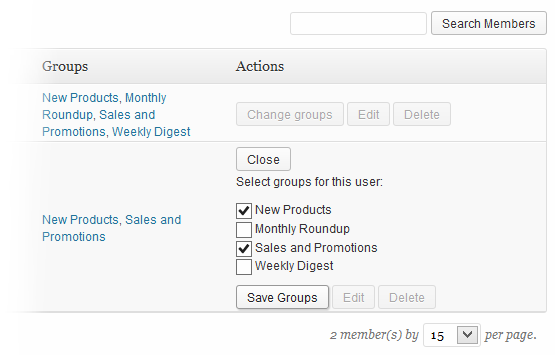

  Du kannst die E-Mail-Adressen und Namen der Mitglieder auch bearbeiten, indem Du einfach auf die Schaltfläche „Bearbeiten“ in der Spalte „Aktionen“ klickst. Sehr praktisch für Mitglieder, die ihre Adresse ändern oder möchten, dass Deine Newsletter an eine andere Adresse gesendet werden.

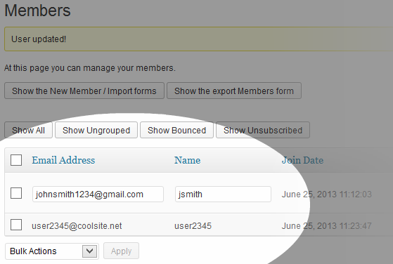

  Oben siehst Du außerdem Schaltflächen mit der Aufschrift „Formulare für neue Mitglieder anzeigen/Importieren“ und „Formular für Exportmitglieder anzeigen“. Wenn Du darauf klickst, werden die Formulare geöffnet, mit denen Du neue Mitglieder erstellen, sie aus einer CSV-Datei hinzufügen oder ausgewählte Gruppen in eine CSV-Datei exportieren kannst.

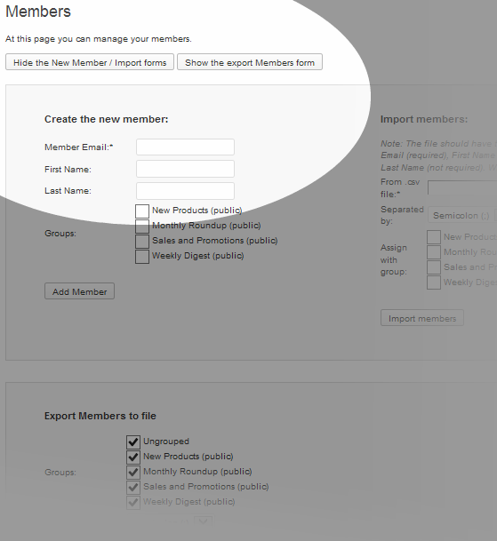

  Beim Importieren einer Mitgliederliste sollte der Inhalt Ihrer CSV-Datei wie folgt aussehen (beachte, dass die Datei keine Kopfzeilen enthalten sollte).

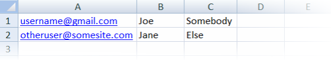

### Benutzer zum Abonnieren bewegen

Wie abonnieren Deine Benutzer Deine Newsletter-Gruppen? Unter „Darstellung“ > „Widgets“ findest Du ein neues Widget, das Du zu jeder beliebigen Seitenleiste hinzufügen kannst.

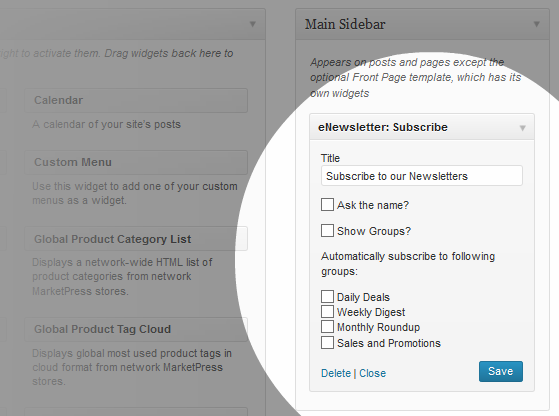

  Abhängig von Deinem Theme könnte es im Frontend so aussehen, wenn Benutzer angemeldet sind. Nicht eingeloggte Besucher müssen selbstverständlich ihre E-Mail-Adresse und optional ihren Namen angeben. 

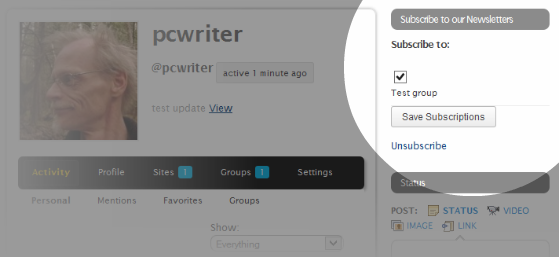

  Du kannst das Abonnementformular auch über einen Shortcode einfügen, wo immer Du es benötigst. „[enewsletter_subscribe]“ Der Shortcode verfügt über 3 Parameter, die Du anpassen kannst.

* _show_name_ aktiviert/deaktiviert das Feld „Name“ im Formular für Webseiten-Besucher.
* _show_groups_ aktiviert/deaktiviert die Gruppenauswahl für Webseiten-Besucher.
* _subscribe_to_groups_ abonniert Benutzer automatisch bei den durch die ID angegebenen Gruppen.

Der wie folgt konfigurierte Shortcode würde beispielsweise die Kontrollkästchen für die Gruppenauswahl ausblenden, den Benutzer automatisch in Gruppen mit den angegebenen IDs eintragen und nach dem Namen des Besuchers fragen. `[enewsletter_subscribe show_name="1" show_groups="0" subscribe_to_groups="1,5"]` Verwende den Shortcode, um das Abonnementformular zu jedem Beitrag oder Seiteninhalt hinzuzufügen, oder füge es mithilfe der Funktion [do_shortcode](http://codex.wordpress.org/Function_Reference/do_shortcode) sogar in benutzerdefinierte Seitenvorlagen ein.

### Benutzerdefinierte Designs verwenden

Ja! Du kannst Deine eigenen benutzerdefinierten Newsletter-Themen erstellen. Kopiere einfach ein vorhandenes Theme aus dem folgenden Ordner: _e-newsletter/email-newsletter-files/templates_ Ändere den Namen des kopierten Themenordners in einen beliebigen Namen. Öffne dann die Datei _style.css_ in Deinem neuen Theme und ändere den Theme-Namen in einen neuen Namen. Jetzt hast Du ein eigenes Theme, das Du nach Herzenslust anpassen kannst. Sobald Du mit der Anpassung fertig bist, musst Du Dein Newsletter-Theme auf Deine Webseite hochladen. Du kannst hierfür entweder FTP oder die Dateimanagerfunktion im cPanel oder Plesk Deines Hosts verwenden. Um zu verhindern, dass Deine benutzerdefinierten Designs beim Aktualisieren des Plugins überschrieben werden, erstellt PS-eNewsletter einen speziellen Ordner für sie, wenn Du das Plugin aktivierst. Du findest den Ordner „enewsletter-custom-themes“ unter wp-content/uploads(+/siteID/, falls in einem einzelnen Blog einer Multi-Site-Installation aktiviert).

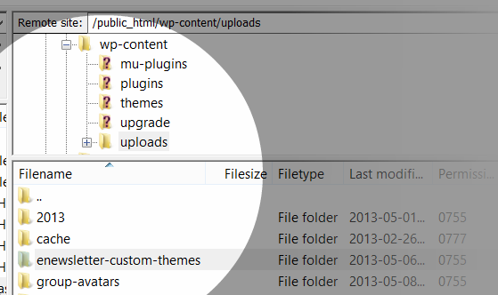

  Sobald Du Deine benutzerdefinierten Themen zu diesem Ordner hinzugefügt hast, stehen sie beim Erstellen oder Bearbeiten eines Newsletters im Vorlagenbereich zur Auswahl zur Verfügung.

### Zusätzliche Anpassungsoptionen

Ja, da ist noch mehr! Du kannst die folgenden Data-Builder-Tags (Makros) entweder im Newsletter-Builder oder in Deinen benutzerdefinierten Designvorlagen verwenden.

* „{FIRST_NAME}“ zeigt den WordPress-Vornamen des Benutzers im Newsletter an
* „{USER_NAME}“ zeigt den WordPress-Benutzernamen des Benutzers im Newsletter an
* „{TO_EMAIL}“ zeigt die E-Mail-Adresse an, an die der Newsletter gesendet wurde
* „{VIEW_LINK}“ zeigt den Link zum Anzeigen des Newsletters in einem Browser an
* „{DATE}“ zeigt das Datum an, an dem der Newsletter gesendet wurde

Du kannst sie beispielsweise zum Inhaltsbereich des Newsletter-Builders hinzufügen:

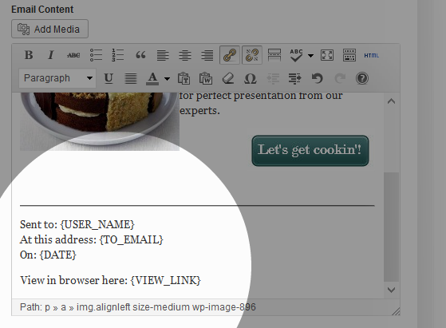

  Und Deine Benutzer würden diese Informationen im Newsletter sehen, den sie erhalten:

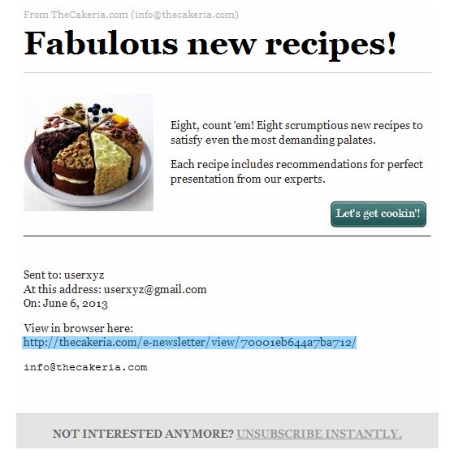